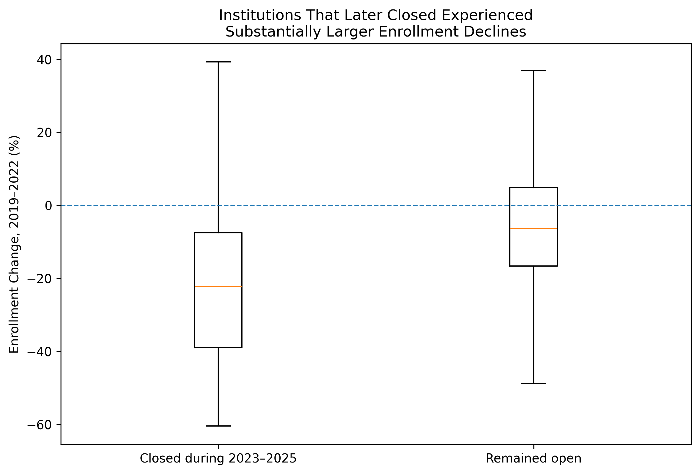
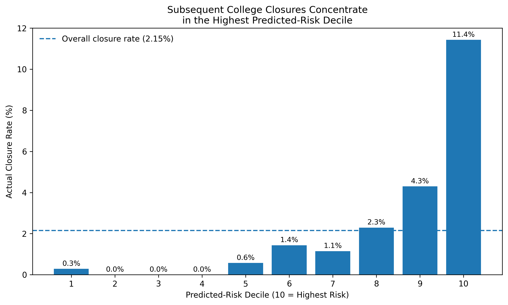
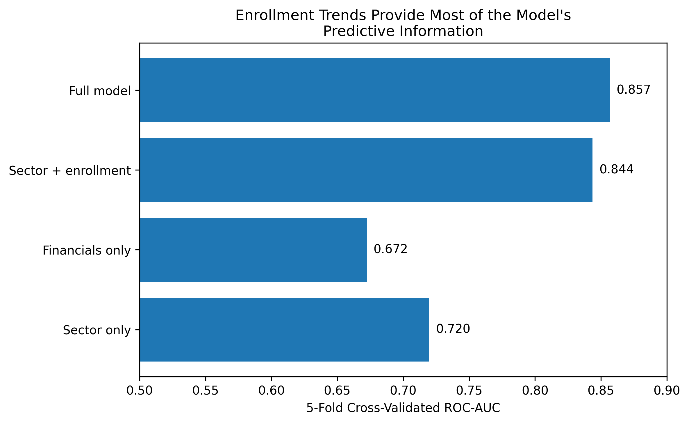

# College Closure Early-Warning Model

Can publicly available enrollment and financial data identify U.S. colleges at elevated risk of subsequent closure?

This project develops a retrospective early-warning model using institutional characteristics available by 2022 and evaluates whether they identify colleges that subsequently closed during 2023–2025.

The final analytical sample contains **3,493 U.S. institutions**, including **75 subsequent closures**.

## Research Question

**Can enrollment trends, institutional sector, and financial condition identify colleges at elevated risk of subsequent closure?**

Rather than attempting to predict with certainty whether an individual institution will close, this project examines whether observable institutional characteristics can identify groups with substantially elevated closure risk.

## Data

The analysis combines publicly available higher-education data from the **Integrated Postsecondary Education Data System (IPEDS)** and **Federal Student Aid closed-school records**.

Predictors include:

- Institutional sector
- Enrollment change from 2019–2022
- Liabilities relative to assets
- Operating margin
- Tuition dependence

The outcome variable identifies institutions that subsequently closed during **2023–2025**.

Financial measures were harmonized across the different IPEDS reporting structures used by public, private nonprofit, and for-profit institutions.

## Methodology

I used an **AI-assisted Python workflow** to clean and merge institutional datasets, construct financial indicators, estimate logistic regression models, and evaluate predictive performance.

The final logistic regression estimates closure risk using:

- Institutional sector
- Liabilities-to-assets ratio
- Operating margin
- Tuition dependence
- 2019–2022 enrollment change

Because closures are rare—only **2.15%** of institutions in the analytical sample—model performance is evaluated using both **ROC-AUC** and **precision-recall AUC (PR-AUC)**.

I used **stratified five-fold cross-validation** so that each institution's out-of-sample probability was generated by a model that was not fitted on that institution.

## Key Findings

### 1. Enrollment deterioration was the strongest early-warning signal

Institutions that subsequently closed experienced a median **22.27% enrollment decline** from 2019–2022, compared with a **6.24% decline** among institutions that remained open.

In the full logistic regression, a **10-percentage-point larger enrollment decline was associated with approximately 37.9% higher odds of subsequent closure**, holding the other included variables constant.



### 2. The model identified concentrated pockets of subsequent closure risk

The full model achieved:

- **ROC-AUC: 0.857**
- **PR-AUC: 0.104**
- **Random PR baseline: 0.0215**
- **PR lift over baseline: 4.8×**

The highest-risk **10% of institutions contained 53.3% of all subsequent closures**.

Those institutions experienced an **11.43% closure rate**, compared with **2.15% overall**, or approximately **5.3× the sample-wide closure rate**.



### 3. Enrollment trends contributed most of the model's predictive information

Five-fold cross-validated performance:

| Model | ROC-AUC | PR-AUC |
|---|---:|---:|
| Sector only | 0.7197 | 0.0418 |
| Financials only | 0.6725 | 0.0350 |
| Sector + enrollment | 0.8437 | 0.1000 |
| Full model | **0.8568** | **0.1039** |

Adding enrollment trends to institutional sector increased ROC-AUC from **0.720 to 0.844**. Adding the available financial indicators increased performance further to **0.857**, but the incremental improvement was substantially smaller.



## Interpretation

The results suggest that sustained enrollment deterioration may function as a useful early-warning indicator of institutional distress.

In these model specifications, recent enrollment trajectory contained substantially more predictive information than the financial ratios alone. One possible interpretation is that enrollment changes capture multiple underlying pressures—including demand, reputation, demographics, and institutional competitiveness—that individual accounting ratios only partially reflect.

The financial variables should not be interpreted as unimportant. Rather, the results indicate that their incremental predictive contribution was relatively modest once institutional sector and enrollment trajectory were known.

## Limitations

This project is **observational and predictive, not causal**. The results do not establish that enrollment decline causes college closure.

Closures are also rare: only **75 of 3,493 institutions** in the final analytical sample closed during 2023–2025. Predictions for individual institutions should therefore be interpreted cautiously.

Five-fold cross-validation evaluates generalization across institutions, but it is **not a true prospective temporal forecast** trained on earlier closure cohorts and deployed on an entirely future cohort.

Financial reporting also differs across institutional sectors, and the selected financial ratios cannot capture every dimension of institutional financial condition.

The model should therefore be interpreted as an **early-warning screening framework**, not a definitive prediction that any particular institution will close.

## Repository Structure

```text
college-closure-early-warning-model/
│
├── College_Closure_Early_Warning_Model_Final.ipynb
├── README.md
│
├── processed_data/
│   ├── college_closure_model_data.csv
│   └── college_closure_risk_rankings.csv
│
└── outputs/
    ├── closure_risk_deciles_final.png
    ├── enrollment_change_closure_final.png
    ├── model_comparison_final.png
    ├── model_performance.csv
    ├── results_summary.csv
    └── risk_decile_results.csv
```

## Tools

- Python
- pandas
- NumPy
- statsmodels
- scikit-learn
- matplotlib
- Google Colab

AI tools were used to assist with Python development, debugging, and workflow design. Statistical results were checked against the underlying model outputs and reproduced in a clean final notebook.
